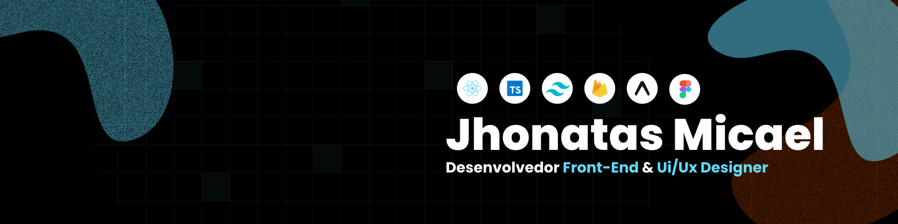

---

## 👋 Sobre mim

Sou **desenvolvedor Front-end e UI/UX Designer**, com foco em criar **interfaces claras, funcionais e bem pensadas**.  
Trabalho principalmente com **React, React Native, e Next.js**, unindo **design e desenvolvimento** para transformar ideias em produtos reais, usáveis e escaláveis.

---

## 📬 Onde me encontrar

  
  
  

---

## 📊 Estatísticas

  
  

---

## 🛠️ Tecnologias & Ferramentas

### ⚙️ Front-end & Mobile

### 🎨 Estilo & UI

### 🔥 Back-end & Infra

---

